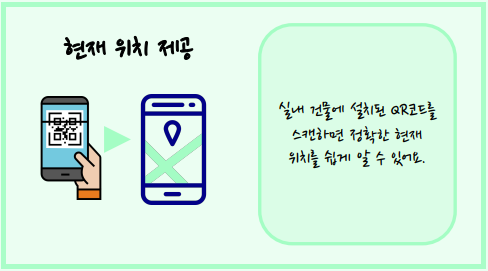
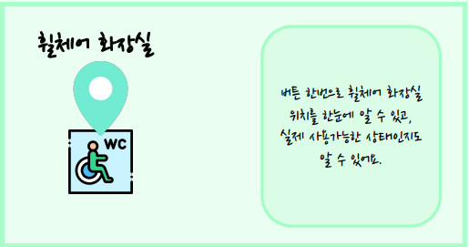
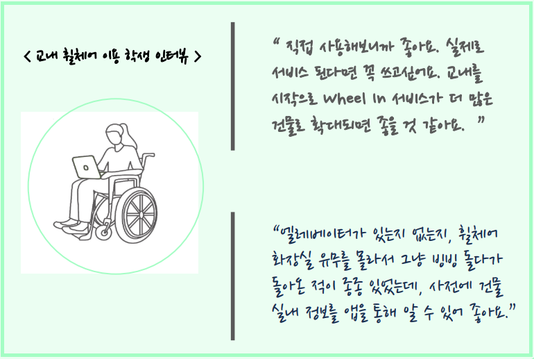

# 캡스톤디자인 41팀 소개 페이지

## 1. 프로젝트 소개


### 휠체어 사용자를 위한 실내 내비게이션

휠체어 사용자들이 지나다닐 수 있는 길은 한정적입니다. 또한 휠체어 사용자들이 이용할 수 있는 시설 또한 한정적입니다.
다행히도 지금의 실외 지도 앱, 내비게이션 앱들은 거리뷰를 통해 길에 대한 구체적인 정보를 미리 확인할 수 있습니다.
하지만 지금의 실내 지도 앱, 내비게이션 앱들은 실내 사진 뿐만 아니라 언덕, 턱, 길의 너비등의 정보를 제공하지 않습니다.
결국 휠체어 사용자들은 직접 겪어보지 않으면 실내 장소에 어떠한 위험요소가 존재하는지에 대해 미리 알 수 없다는 것입니다.
이러한 문제 의식을 통해 이 프로젝트는 휠체어 사용자가 실내에 대한 정보를 미리 파악하고, 위험요소를 사전에 차단하여 안전하게 실내에서 길을 찾을 수 있도록 도와주는 어플을 기획하게 되었습니다.

**QR코드를 통한 현재 위치 파악 서비스와 현재 위치에서 휠체어 사용자들이 목적지까지 보다 안전하게 도착할 수 있도록 길을 안내하는 내비게이션 서비스를 구현하고자 합니다. 또한 사용자의 니즈를 분석하여 휠체어 사용자들이 자주 이용하고, 이용하기 전 사전 정보가 필요한 시설들에 대한 정보를 제공하는 서비스 또한 구현하고자 합니다.**

### Abstract

Wheelchair users have limited access. Also, the facilities available to wheelchair users are limited.
Fortunately, today's outdoor map apps and navigation apps can check specific information about the road in advance through street views.
However, today's indoor map apps and navigation apps do not provide information such as hills, jaws, and the width of roads as well as indoor photos.
In the end, wheelchair users will not know in advance what risks exist in indoor places unless they have experienced themselves.
This awareness of the problem led the project to plan an application that helps wheelchair users find their way indoors safely by grasping indoor information in advance and blocking hazards in advance.

**We want to implement a current location service through QR code and a navigation service that guides wheelchair users on their way to their destination more safely. We also want to implement a service that analyzes users' needs and provides information on facilities that are frequently used by wheelchair users and require prior information before using them.**


## 2. 주요 기능






## 3. 기대 효과





## 4. 시연 동영상

[시연 영상](https://youtu.be/OKeUUpQoPHQ)


## 5. 소개 자료

[중간발표자료](https://github.com/kookmin-sw/capstone-2023-41/blob/main/docs/팀41_중간발표자료_최종.pdf)

[중간보고서](https://github.com/kookmin-sw/capstone-2023-41/blob/main/docs/팀41_중간보고서.pdf)

[최종발표자료](https://github.com/kookmin-sw/capstone-2023-41/blob/main/docs/팀41_최종발표자료.pdf)

[수행결과보고서](https://github.com/kookmin-sw/capstone-2023-41/blob/main/docs/팀41_수행결과보고서.pdf)


## 6. 팀 소개

#### 송희용(팀장): [Gnoyh](https://github.com/Gnoyh)

```
Student ID: ****1634
E-mail: aksenhs@kookmin.ac.kr
Role: PM / Backend (sub)
    • Product Manager
    • DataBase 관리
    • 길 안내 서비스 구현
```

#### 손민우: [Minwoo Son](https://github.com/MarkSon-42)

```
Student ID: ****2833
E-mail: systema5811@kookmin.ac.kr
Role: Fronted / PM (sub)
    • UI 제작
    • 비상 연락 및 세부기능 구현
    • VCS, 협업 관리
```

#### 신근철: [Shin](https://github.com/maecher)

```
Student ID: ****3119
E-mail: aia7520@kookmin.ac.kr
Role: Backend / Frontend (sub)
    • 지도 뷰 구현
    • 건물 약도 제작
    • 지도 위에 경로 및 마커 구현
```

#### 안성준: [anseongjun](https://github.com/anseongjun)

```
Student ID: ****1642
E-mail: dkstjdwns@kookmin.ac.kr
Role: Backend / Frontend (sub)
    • 검색 및 자동완성 구현
    • 위치 정보창 구현
    • UI 조정
```
